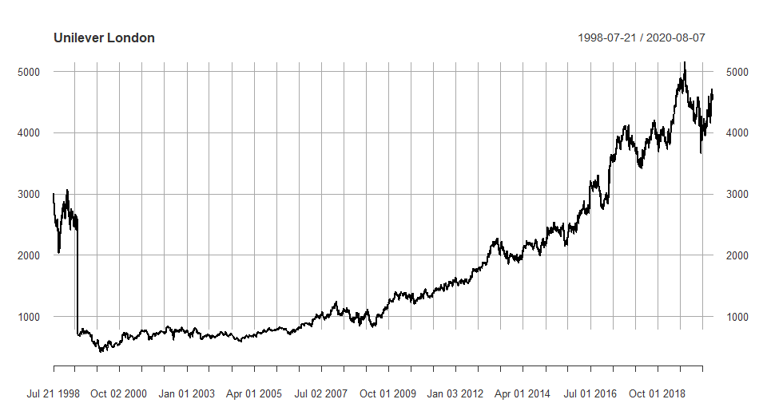

# Unilever Time Series Analysis

Unilever dual-listing existence, motivation for exercise, and data description

### Common dates

write ARIMA model for UL_L and MAPE
https://stats.stackexchange.com/questions/194453/interpreting-accuracy-results-for-an-arima-model-fit

plot fitted model vs UL_L
https://stats.stackexchange.com/questions/158493/how-to-compare-arima-model-in-r-to-actual-observations-used-to-create-the-model

plot residuals
https://otexts.com/fpp3/regarima.html

plot UL_L and UL_A log returns on same plot

write ARIMAX model for UL_A using UL_L 

plot fitted model vs UL_L

plot residuals
