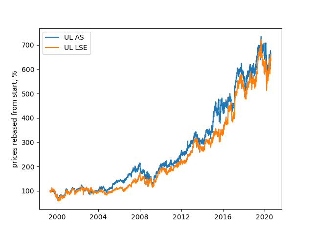
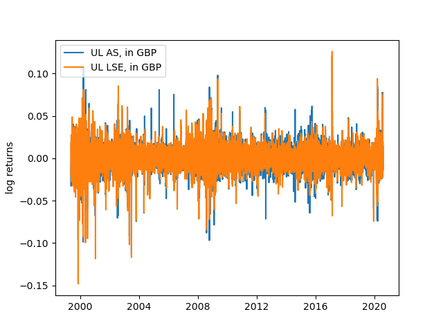
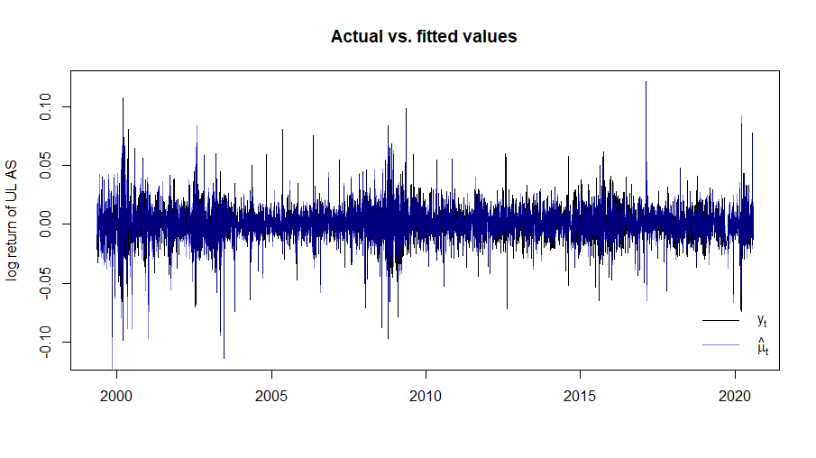
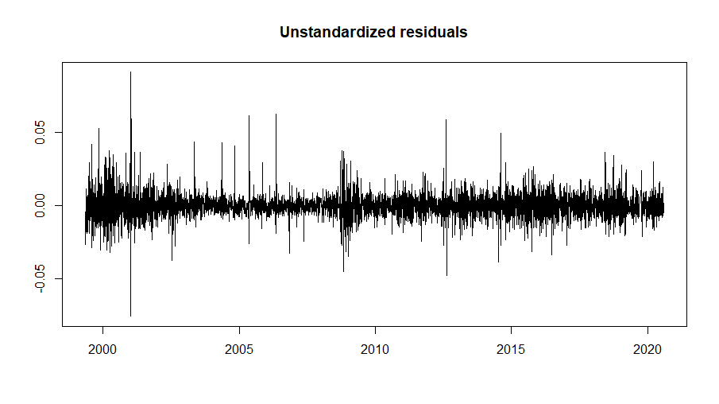

# Unilever Time Series Analysis

Unilever has had a dual listing in the UK and Netherlands since 1930. Since shareholders run the company as a single business, I want to validate whether the returns of the two stocks move in tandem. Graphs, stats, and discussion below. I was inspired to run this analysis after taking Financial Data Science (CFRM 502) in the University of Washington Computational Finance Program, taught by Professor Bahman Angoshtari, in Winter 2020.

### Prices of listings

### Log returns of listings

### Model for UL_A using UL_L

TODO convert model to image

y is log returns of UL AS, x is log returns of UL LSE, both based on pound prices

(1-.086422B)(y_t - .936292*x_t)  = (1-.530315B)*a_t

a_t = sigma_t * eps_t

eps_t ~ t_(df=5.810244,skew=1.060114)

sigma_t^2 = .000002 + .203415*(a_(t-1))^2 + .356892*(sigma_(t-1))^2 + .295053*(sigma_(t-3))^2 + .102554*(sigma_(t-5))^2

Log Likelihood:						18973 
Akaike Information Criterion (AIC):	-7.1137
Bayes Information Criterion (BIC):	-7.0952

Model Mean Prediction:
Mean Absolute Error (MAE):			.005701158
Root-mean-square error (RMSE):		.008212241

Model Variance Prediction:
MAE:								.005701158
RMSE:								.0002163114

### Discussion

I expected that mean returns are nearly the same and near constant volatility, since traders would take advantage of the arbitrage. However, differencies in the UK/EU laws, market participants, and currencies could create a discrepancy, especially with Brexit in 2016.

### Data

Adjusted close price is used for each stock. The prices for Unilever Amsterdam and London are from 5/10/1999 til 8/7/2020 inclusive.

### Definitions

[MAE](https://en.wikipedia.org/wiki/Mean_absolute_error)
,
[RMSE](https://en.wikipedia.org/wiki/Root-mean-square_deviation)
,
[Log Likelihood](https://en.wikipedia.org/wiki/Likelihood_function#Log-likelihood)
,
[AIC](https://en.wikipedia.org/wiki/Akaike_information_criterion)
,
[BIC](https://en.wikipedia.org/wiki/Bayesian_information_criterion)

### References

[Formula Image Generator](https://www.codecogs.com/latex/eqneditor.php)
,
[Plotting ARIMA](https://cran.r-project.org/web/packages/qrmtools/vignettes/ARMA_GARCH_VaR.html)
