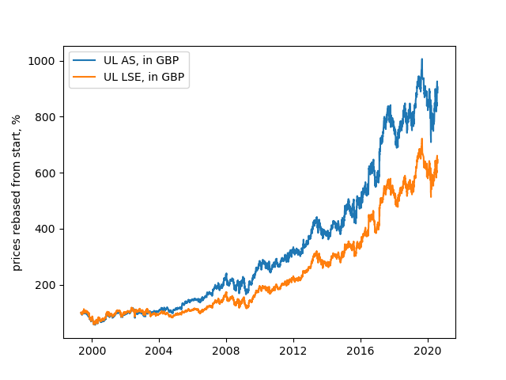

# Unilever Time Series Analysis

Unilever has had a dual listing in the UK and Netherlands since 1930. Since shareholders run the company as a single business, I want to validate whether the returns of the two stocks (UL in LSE, AS) move in tandem. Graphs, stats, and discussion below. I was inspired to run this analysis after taking Financial Data Science (CFRM 502) in the University of Washington Computational Finance Program, taught by Professor Bahman Angoshtari, in Winter 2020.

###### Code for next 2 plots in plot_UL.py
### Prices of listings

### Log returns of listings

###### Code for model, plots, and model statistics in time_series_model.R
### Model for UL_A using UL_L

### Model

y is log returns of UL AS, x is log returns of UL LSE, both based on prices in pounds

| Criteria                           |               |
| ---------------------------------- | ------------- |
| Log Likelihood                     | 18973         |
| Akaike Information Criterion (AIC) | 	-7.1137      |
| Bayes Information Criterion (BIC)) | -7.0952       |

| Prediction Errors             | Mean Prediction | Variance Prediction |
| ----------------------------- | --------------- | ------------------- |
| Mean Absolute Error (MAE)     | .005701158      | 7.299417e-05        |
| Root-mean-square error (RMSE  | .008212241      | .0002163114         |

### Discussion

I expected mean returns and variance would be nearly the same for the two assets, since traders would perform convergence trades. The model to predict UL AS from UL LSE wasn't able to predict many spikes, but had small residuals otherwise. The regression factor for UL LSE was 93.6%, which is significant. The remaining difference in returns could be because of exchange risk (£⟷€), market depth, or barriers for convergence trading.

### Data

Adjusted close price is used for each stock. The prices for Unilever Amsterdam and London, and Euro to GBP exchange rates are from 5/10/1999 til 8/7/2020 inclusive. Data source is Yahoo Finance

### Definitions

[MAE](https://en.wikipedia.org/wiki/Mean_absolute_error)
,
[RMSE](https://en.wikipedia.org/wiki/Root-mean-square_deviation)
,
[Log Likelihood](https://en.wikipedia.org/wiki/Likelihood_function#Log-likelihood)
,
[AIC](https://en.wikipedia.org/wiki/Akaike_information_criterion)
,
[BIC](https://en.wikipedia.org/wiki/Bayesian_information_criterion)

### References

[Formula Image Generator](https://www.codecogs.com/latex/eqneditor.php)
,
[Plotting ARIMA](https://cran.r-project.org/web/packages/qrmtools/vignettes/ARMA_GARCH_VaR.html)
